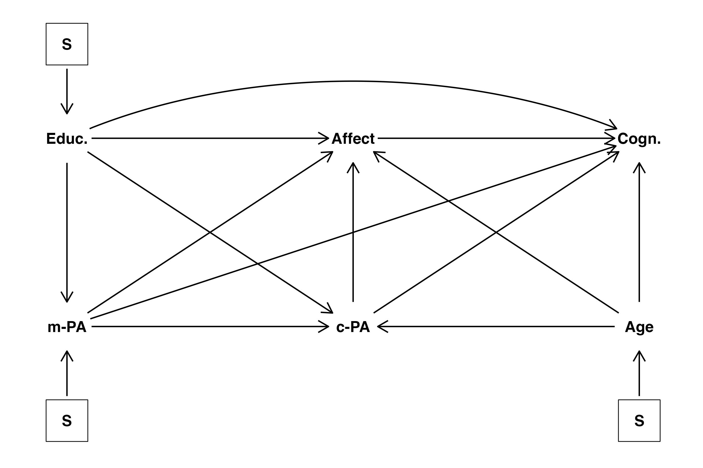
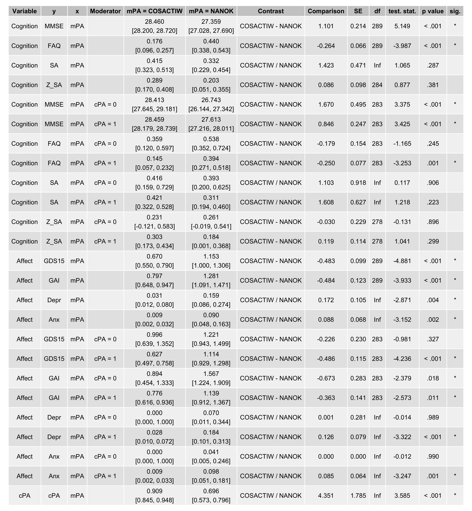
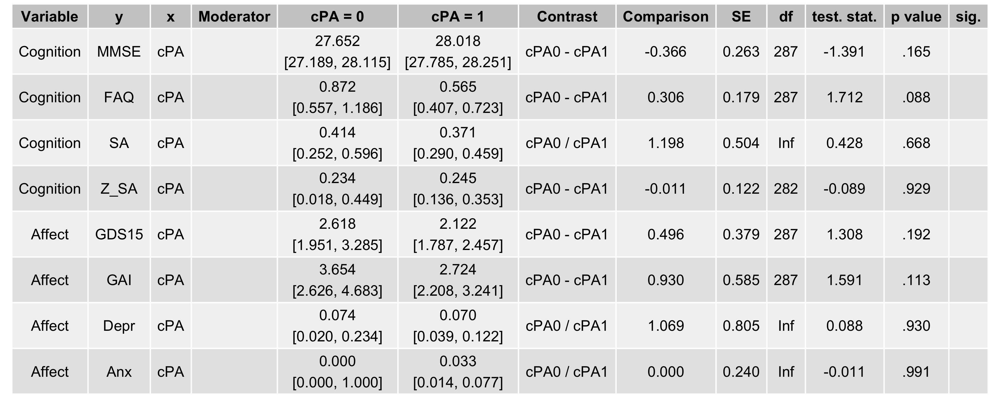
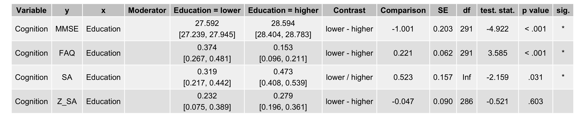
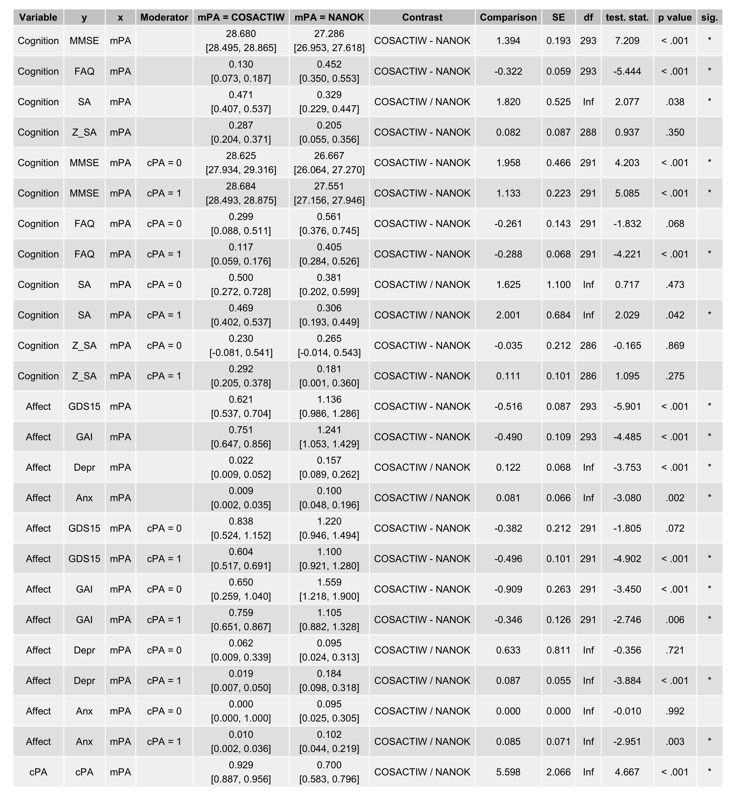
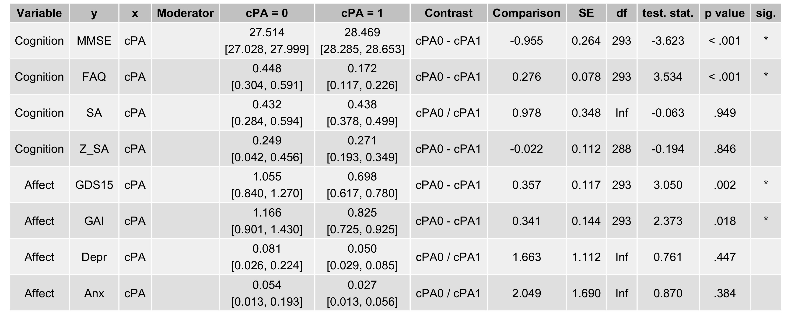
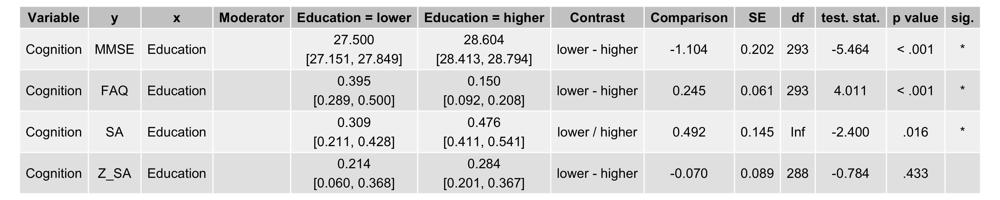
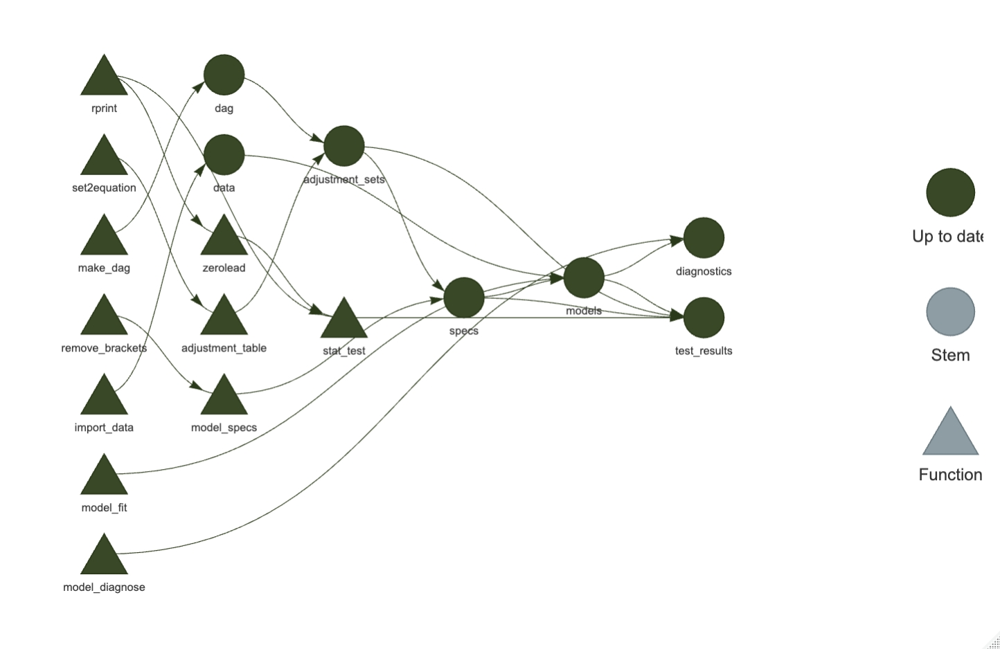

# cosactiw-brief-report

My humble contribution to the COSACTIW vs NANOK comparisons of the primary outcome report approximating
the effect of midlife physical activity on (super)aging parameters.

## Analysis & Summary of Results

The analysis consists of a set of GLMs (logistic for binary variables, least squares Gaussian regressions for continuous variables)
with adjustment sets derived from causal assumptions depicted in the following DAG:



Estimates comprise of a set of marginalised means and their comparisons from GLMs regressing the outcome on exposure and
adjustement set derived from the DAG above. Interactions of exposure and all adjustement set variable were included whereas
interactions between adjustment sets. The results are presented for midlife-PA, current-PA and Education as exposures of
interest respectively:





These can be contrasted against estimates of otherwise equivalent GLMs with no covariates:





## Transparency & Reproducibility

The [renv](https://rstudio.github.io/renv/) package was used to create reproducible environment for the project.
To set-up R environment for reproduction of our results, run:

```
#install.packages("renv")
renv::restore()
```

The [targets](https://docs.ropensci.org/targets/) package was used to create a reproducible analysis pipeline.
The data are not being shared for the time being. If you managed to get them from the main authors, put them into
the `_raw/` folder and run the analyses using the following code:

```
#install.packages("targets")
targets::tar_make()
```

The current pipeline looks as follows:


